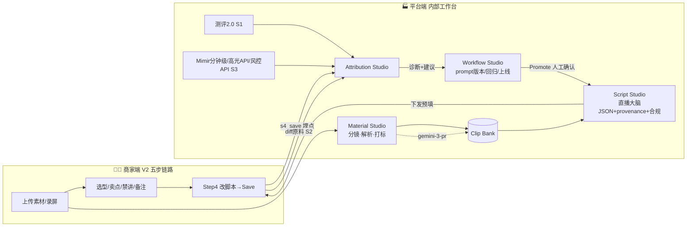

<!-- DOC-CARD
类型：V3 平台端（Internal）内部工作台页面级方案 · 讨论稿
一句话：服务运营/产品/算法的**内部工作台产品**，把"素材加工→剧本生产→反馈归因→算法工作流"四条链路封装成闭环；商家全程无感，仅通过埋点喂数据。
品牌：沿用 V2 主色 Teal + 状态色保持品牌一致；但布局以**信息密度/工作流**为先，不套商家向导壳（这是内部工具，不是商家页面）。
图片识别：素材分镜/画面理解/打标统一 `gemini-3-pro-preview-new`（ModelHub 内网）。
配套：商家端见《V3商家端页面级方案（基于V2链路迭代）.md》；原则见《V3最终版本讨论草稿-持续Log.md》Log 0006/0007/0009。
读法：§1 信息架构 → §2~§5 四大台 → §6 闭环图 → §7 商家接口 → §8 复用既有能力。
-->

# V3 平台端 · 内部工作台页面级方案 · 讨论稿

> 双端原则：🏭 平台端＝生产 + 智能层。素材分镜/解析→Clip Bank、剧本（直播大脑 JSON）生产、provenance 溯源、合规左移、反馈与归因（S2 diff / 分钟级双视角 / 诊断 / 人工确认改 prompt / 测评 2.0 回归）、算法工作流——**全部封装于此**，配内部工作台服务运营/产品/算法。

---

## §0 定位与设计原则

| 项 | 说明 |
|---|---|
| **用户** | 内部：运营（看效果/管素材/管 prompt 上线）、产品（看链路/诊断/决策）、算法（调 prompt/跑测评/看归因）。 |
| **不是商家页面** | 不套 `Create AI LIVE` 向导壳；用经典内部后台：左导航 + 顶部面包屑 + 中部工作区 + 右侧详情抽屉。 |
| **品牌一致** | 主色仍用 **Teal**，状态色沿用 V2（Ready 绿 / Generating 蓝 / Live 红粉 / Ended 灰 / Draft 琥珀），让内外产品同源；但允许更高信息密度（表格/看板/diff 双栏）。 |
| **图片识别** | 画面/帧/图片理解一律 `gemini-3-pro-preview-new`（ModelHub 内网）；纯文本 LLM（清洗/扩写/翻译/diff 分类）与 ASR 不在替换范围。 |
| **复用优先** | 分钟级数据用 Mimir；高光识别复用 `直播高光片段剪辑` 算法；风险归因复用 Creator Risk Investigation API；渲染复用百度慧播星底板（见 §8）。 |

---

## §1 信息架构（左导航）

```
AI LIVE Brain · Console（内部） · Demo 导航顺序（Log 0036）
├─ 🎬 Material Studio 素材加工台 【P0】 ← ①整体素材解析(按来源汇总) → ②按商品维度(可搜ID/名称) → 解析 → Clip Bank
├─ 📡 AI LIVE 直播监控看板 【P0】（原 Attribution Studio）← 脚本 diff（店铺×商品）/ 分钟级监控（消费侧 × 风控 · room_id 同一时间轴）/ 诊断
├─ 🧩 Script Studio 剧本生产台 【P1】 ← 直播大脑 JSON 生产 + 合规左移 + provenance
├─ 🧪 脚本优化生产 & 测评 【P0】 ← 承接监控看板诊断/归因 → 优化 prompt 与生产 → 测评 2.0 回归；**实时挂载《脚本生产与测评 Pipeline · 算法研发对齐稿》**（iframe 同源加载项目根文件，源文档持续更新、本页自动同步）
├─ ⚙️ Workflow Studio 算法诊断/工作流平台 ← prompt 版本/灰度/回归测评/上线（demo 先隐藏，代码保留）
└─ 🗄 Clip Bank / Asset Registry  ← 结构化素材资产库（被各台引用）
```

> **导航顺序与优先级（Log 0036）**：① AI LIVE 直播监控看板优先级 **P1 → P0**；② 导航顺序 **Material → 监控看板 → Script Studio**（Script 排监控看板之后）；③ **新增「🧪 脚本优化生产 & 测评」**菜单（与 Material 并列）。
>
> **🧪 脚本优化生产 & 测评（Log 0037）**：优先级 **P1 → P0**；模块内容**实时挂载《脚本生产与测评 Pipeline · 算法研发对齐稿》**（`demo/platform/index.html` 的 `renderOptimize` 用 iframe 同源相对路径 `../../../脚本生产与测评Pipeline-算法研发对齐稿.html` 加载项目根文件）。该对齐稿由算法研发持续更新，本页**自动同步**（刷新即最新），含「↗ 新标签打开 / ⟳ 刷新对齐稿」。
>
> **当前 Demo 口径**：演示 demo 顶部导航先隐藏 `📊 Overview 总览看板` 与 `⚙️ Workflow / Overview`（代码保留、后续放开）；本文档完整架构不变。

---

## §1.5 双模式与平台端的关系 · `mode` 字段轻感知（Log 0024）

商家端 Step2 后分**模式一（经典分步 · P0）/ 模式二（智能剧本 · P2）**，但二者：**同产一份「直播大脑 JSON」、平台端生产链路不分叉、JSON schema 完全一致**——平台端**不需要为两种模式写两套生产逻辑**。

不过平台端需对模式做**「轻感知」**（不是无感知）：在场次级埋一个 `mode ∈ {classic, smart}` 字段，贯穿以下几处，用于**分析 / 溯源 / 归因 / A-B**：

| 落点 | 用途 |
|---|---|
| `shared_context.mode` | 随直播任务下发，生产时记录该场来自哪种编辑形态 |
| `provenance.mode` | 每个原子溯源带 mode，归因时可按模式切片（如"smart 模式的脚本改动率/合规命中率"） |
| Attribution 看板筛选维度 | 场次列表、归因曲线可按 `mode` 过滤，对比两模式的 GMV/转化/diff 改动量 |
| Overview 总览 | 两模式渗透率、留存、转化对比，支撑"模式二是否值得加码"的决策与 A-B |

> 一句话：**生产逻辑不分叉（省成本），但数据维度要带 `mode`（能归因）**。模式一脚本走 V2 既有能力时，`mode=classic` 且 `provenance` 标注脚本来源为 V2 链路。

---

## §2 🎬 Material Studio · 素材加工台（链路一：素材→Clip Bank）【P0】

> **优先级【P0】**：与商家端模式一同为第一优先。先把素材库抽象出来、把"素材→视频 clip"的加工链路做完整，是模式一闭环的基础。**理解 prompt（素材打标）随本台一起 P0**（详见 §3 双 prompt 分层）。
>
> ⭐ **Demo 组织（Log 0036）**：① **整体素材解析情况（按来源汇总）提到最前**＝该商家 ID 的全局解析概览（各来源提交量/产出 clips/解析进度），先看全局；② 再下钻 **按商品维度**（一级=商品聚合强相关 clips，**支持按商品 ID / 名称搜索**，来源下沉到 clip 详情）；③ 加工 Pipeline。顺序＝① 整体 → ② 商品维度 → ③ Pipeline。

**职责**：把商家上传素材 / 直播录屏 / 商家 TikTok 账号已发布短视频，自动分镜 + 画面理解 + 打标，沉淀为结构化 **Clip Bank**。

### 素材来源与授权 + 两类素材映射（V3 对齐）
**平台侧输入 = 类型1 原始素材**（未加工）；平台经「分镜→画面理解→打标」**产出 = 类型2 视频 clip**，**经运营采纳后**回填商家端 `My assets`。入库 clip 标 `source` 以便追溯（**不写笼统的 `upload`，按商家上传的两种方式精确区分**）：
1. **method1_background**：商家在选数字人时作为 **`Background` 背景视频上传**的素材（方式1，对应 **layer=background**）；
2. **method2_use_your_video**：商家通过 **`Use your video` 上传**的前景素材（方式2，对应 **layer=foreground**）；
3. **live_replay**：直播录屏解析分镜（仅产 clip，属类型2）；
4. **tiktok_post**：**商家 TikTok 账号已发布的短视频**（自有账号，授权拉取后自动分镜）。

> **两类映射（与商家端 §5 两 Tab 一致）**：类型1（原始）= `method1_background` + `method2_use_your_video` + `tiktok_post` 的原片；类型2（clip）= `live_replay` 的 clip + 对类型1 解析出的 clip。同一条原片可同时被用作前景或背景。

> 合规：三类均为商家**自有内容**，不命中"搬运/盗播"红线（治理库 §9 #5~8/#11）。
> **规划项（V3 暂不开放）** `creator_video`：达人为商家商品带货产生的视频——属**他人内容**，须**达人逐条授权**并带授权凭证、标 `source=creator_video` 后方可入库；未授权一律不可用（规避搬运/盗播）。

### 页面布局

> ⭐ **Log 0035 起：素材改「商品维度」组织**——商家组织结构＝店铺→商品，直播也先选品，故 **一级目录＝商品**，每个商品聚合**与它最强相关**的视频 clips（按 match_score 排序）。**素材来源**（本地上传 / 关联 TikTok 已发布 / 历史直播回放）**下沉到 clip 详情抽屉**查看，不再作一级分组。原"按来源汇总统计 + 单条素材明细"降为**「② 按来源看素材池」次要运营视图**（统计仍保留）。下文"来源/分镜时间轴"逻辑保留在次要视图内。

- 左：素材源列表，筛选维度：
  - 来源 `source`（upload/live_replay/tiktok_post）、`live_id`（= **直播间 roomid**）、时间、状态 pill（Processing 蓝 / Done 绿 / Failed 灰）；
  - **商家维度**：`Shop ID`（店铺ID）、`Shop Name`（店铺名称）、**开播账号**（开直播的 TikTok 账号）、`Author_id`（TikTok TT handle id）、`Fans`（开播账号粉丝数）、**近 30 天开播次数**。
- 中：**素材列表 + 分镜时间轴（多素材展示规则）**——
  - **① 来源维度汇总统计卡（顶部）**：三类来源各一张统计卡，先给"总量"再看明细——
    - 本地上传：上传素材数 / 已解析 / 待解析 / 产出 clips 数；
    - 关联 TikTok 已发布：已发布视频数 / 已解析 / 待解析 / 产出 clips 数；
    - 历史直播回放：历史场次数 + **累计时长** / 已解析 / 待解析 / 产出 clips 数。
    每卡带"解析进度 %"进度条，点开才看单条原始素材明细。
  - 上半区是该商家的**原始素材清单**（如 10 个上传素材 + 1 个直播录屏），按 `source` 分组、每条一行（缩略图 + 来源 badge + 时长 + 解析状态）；
  - 选中某条原始素材 → 下半区展开它的**分镜时间轴**：原视频帧带 + 自动切分的 clip 段（每段缩略图 + 时长 badge + 自动标签）。
  - 即「左选商家/任务 → 中上选具体素材 → 中下看该素材分镜」，避免多素材混在一条轴上看不清。
- 右：clip 详情抽屉——见下「Clip 字段」。

### Clip 字段（对齐 Demo Clip Bank）
| 字段 | 说明 |
|---|---|
| `clip_type` | 类型态：**strong**（强可用·绿）/ **bg**（背景素材·金）/ **risk**（风险·不可用·灰） |
| `has_speech` | **是否有人声**（解析分流开关）：无人声/仅 BGM → 走纯画面理解出 tags，不强行 ASR；有人声 → 做 ASR |
| `visual` | 画面视觉内容理解（`gemini-3-pro-preview-new`）。**无人声素材主要靠它输出 tags/卖点** |
| `asr` | 原始 ASR 文案（句级时间戳）。**仅当 `has_speech=true` 时产出**；无人声素材此字段为空 |
| `asr_lang` | **口播语言**（仅 `has_speech=true` 时标）：`en` / `es`，由 ASR 识别。**与商家端 Step1 `Market/Language`（`shared_context.language`）做一致性校验**——不一致（如西语场用了英语口播素材）标 `lang_mismatch` 提示，供运营采纳时参考；与素材推荐/排序联动（优先推同语言 clip） |
| `match_score` | **商品匹配度**（0–100，meter 进度条展示，用于排序/筛选）。**比对集 = 该商家近 30 天有动销的商品全集**（含商家端历史已选商品）；逐 clip 对该集算匹配度 |
| `recommend_use` | **推荐用途**（建议 layer：`background`/`foreground`/`none` + 适配 Scene/卖点建议；`foreground`↔方式2、`background`↔方式1。**不含 pip**，V3 已砍 PIP） |
| `visual.layer` | **底层渲染字段（保留）**：`{background, foreground, none}` 供渲染引擎决定叠放（商家端不暴露此字段，仅由平台/渲染使用；V3 已移除 `pip`） |
| `format` | **标准化产出格式**：MP4 / 5s–15min / ≤700MB / 1080×1920 / ≥24fps / H.264——产 clip 时即转码达标，商家端可**直接复用**，无需再做素材格式处理 |
| `tags` | 品类 / 卖点 / 场景标签 |
| `duration` | 时长 badge |
| 操作 | 采纳/丢弃、改标签、合并/拆分、入 Clip Bank 开关。**采纳门控：仅当运营点【采纳】后，该 clip 才在商家端 `My assets` 的 `Clips` Tab 展示**；未采纳不对商家可见 |

### 数据流
```
原始素材 → 检测 has_speech（是否有人声）？
   ├─ 有人声        → ASR(句级时间戳) ─┐
   └─ 无人声/仅 BGM → 跳过 ASR ────────┤
                                       │
画面帧抽取（★必经路线，所有素材都走）→ gemini-3-pro-preview-new（自动分镜+画面理解+打标）
                                       │
                                       ▼
   候选 clip（缩略图/标签/质量分/匹配度/推荐用途/risk态/标准化format/has_speech）
                                       │ 运营【采纳】门控
                                       ▼
              Clip Bank 入库 → 采纳后回填商家端 My assets·Clips
```
> **画面帧抽取必经**：很多商家素材无人声或只有 BGM，无法靠 ASR 理解，必须抽关键帧做画面理解出 tags；故画面帧抽取是主干、ASR 是条件分支。
> **录屏解析范围**：直播录屏常达十几小时 / 十几 G，全量解析成本过高——**默认只解析该商家最近 1 次直播录屏**（更早录屏按需手动触发）。

### 图片识别点
- 自动分镜、画面内容理解、卖点/场景/品类打标、封面优选 → 全部 `gemini-3-pro-preview-new`。
- **复用 + 白盒展示原理**：分镜切分复用 `直播高光片段剪辑` 的自动场景切分能力（Log 0006），但需**白盒说明基本算法原理**、不黑盒"一键复用"：① **镜头边界检测**（相邻帧直方图/特征差异超阈值即判切点）；② **语义聚合**（相邻同主题镜头合并成一个 clip）；③ **质量/卖点打分**（清晰度/构图 + 多模态卖点识别）；④ **风险过滤**（命中治理红线标 `risk`）。

### 关键交互
- clip 卡：采纳/丢弃、改标签、合并/拆分段；批量入库。
- 失败重试 + 错误明细（编码/时长/分辨率不达标）。

---

## §3 📝 Script Studio · 剧本生产台（链路二：剧本 JSON 生产 + provenance + 合规左移）【P2】

> **优先级【P2】**：主-子 Agent 智能编排剧本生产改动量大，作为后置 P2；**架构本期先设计好**（双 prompt / 共享上下文 / provenance / 画面层级模型），实现随商家端模式二（智能剧本）一起落地。
> **⚠️ 与模式一的关系**：模式一（P0）Step4 脚本用的是 **V2 既有脚本生成能力**，**不依赖本台的主-子 Agent 编排**；本台编排是模式二（P2）的生产后台。
> **★ 双 prompt 优先级分层（Log 0025）**：**① 理解 prompt（素材打标）随 Material Studio 进 P0**（模式一也要素材加工）；**② 生成 prompt（剧本编排）随本 Script Studio 进 P2**。

**职责**：以**主-子 Agent 编排模型**产出"直播大脑 JSON"——L0 整场主 Agent 编排开场/品序/结尾/全局，6 条职能 subagent（选品/脚本/画面/互动/运营/声音/场外音）横切整场、**共享上下文**、并行产出后对齐同一时间轴；并写 provenance、做合规左移。这是商家端 Step4 LIVE Storyboard 的**生产后台**（编排模型对商家无感）。

### 页面布局（按 商家ID + 直播任务ID 组织）
- **顶层导航 = 商家 `Shop ID` → 直播任务 `task_id`**（对应商家端创建的每个直播任务）；选定某任务后才进入下方左/中/右三栏。
- 左：直播大脑 JSON 结构树 = **L0 主 Agent**（Opening / Product 序 / Closing / 全局风格）→ **6 职能 subagent**（选品/脚本/画面/互动/运营/声音/场外音）；选品 subagent 下展开 `品 → 卖点 Scene → hook/body/cta` 时间轴。
- 中：JSON 编排视图（时间轴 + **多轨道原子卡**）+ **双 prompt 面板**（① 理解 prompt ② 生成 prompt，只读展示当前版本，编辑入口在 Workflow Studio）。
- 右：**provenance 抽屉**——每个原子展开可见：所属 `agent_role`/`track`、来源 prompt 版本、生产阶段、引用的 Clip Bank 资产、命中的卖点/禁讲约束、合规检查结果。

### ★ 双 prompt 定义 + 剧本生产触发时机

- **① 理解 prompt（Understanding）**：作用对象 `gemini-3-pro-preview-new`（多模态，看视频/图片），在 **Material Studio（链路一）** 指挥模型对素材做自动分镜 + 画面内容理解 + 卖点/场景/品类打标 + 封面优选，把原始视频"看懂"并结构化成 Clip Bank（`visual` 字段即其产物）。一句话：把"一段视频"翻译成"机器能用的结构化标签"，决定**素材理解得准不准**。
- **② 生成 prompt（Generation）**：作用对象**纯文本 LLM**（剧本编排，不在图片识别替换范围），在 **Script Studio（链路二）** 把 `Clip Bank + 商家输入(卖点/禁讲/悄悄话) + 商家选中的商品列表 + 平台治理红线` 组装进提示词，产出直播大脑 JSON（多轨道原子对齐时间轴），并触发合规左移、写 provenance。一句话：把"理解好的素材 + 约束"组织成"一场能播的剧本"，决定**剧本写得好不好、合不合规**。
- **★ 剧本生产触发时机（重大修正·很关键）**：生成 prompt 的核心输入是**商家选中的商品列表**，因此**剧本生产在商家端 Step2 选品完成、点"下一步"离开 Step2 时就立刻触发**（后台异步）——**不是**等到 Step3 结束进 Step4 才触发。Step3 的素材/scenes/悄悄话作为**后续增量重生成**的输入。这样商家进入 Step3/Step4 时初稿已就绪，体验更顺。

### ★ 主-子 Agent 编排模型 + 共享上下文 schema（Log 0014–0016 落地）

**编排结构**（整场级、按职能横切、共享上下文、并行产出后对齐时间轴）：
```
L0 整场主 Agent（= 一场直播 = 商家端一个直播任务）
  产出：开场 / 品序编排 / 结尾 / 全局风格调度
  ├─ 选品 subagent     一品 N 卖点(Scene) → 品级小剧本（带时间轴 = 直播大脑 JSON）
  ├─ 脚本 subagent     口播 hook/body/cta
  ├─ 画面 subagent     visual.layer{bg/fg/none}（已砍 pip） + clip 引用
  ├─ 互动 subagent     整场 / 商品维度（独立模块）
  ├─ 运营 subagent     商品维度（价格牌 / 秒杀 / 楔子，联动 overlay）
  ├─ 声音 subagent 🆕（V3 规划占位）   音色 / 语气 / 语速（TTS）
  └─ 场外音 subagent 🆕（V3 规划占位） 旁白 / 场控 / 助播 / BGM（强化真人在场·对冲红线 #15）
  调度：各 subagent 并行产出 → 主 Agent 对齐同一时间轴
        （并行 ≠ 无依赖：读彼此「已产出原子」解决依赖，不读中间过程）
```

> 为什么并行：互动/脚本/画面/声音/场外音各由**独立 PM** 设计、各有**独立测评 rubric**，天然解耦；主 Agent 是编排器/协调者，不做串行流水线。

**共享上下文 schema（随直播大脑 JSON schema 一起落，不单独成稿——Log 0017 决策）**：

| 层 | 谁可读 | 内容 |
|---|---|---|
| `shared_context` | 全 subagent 可读（**字节稳定前缀**） | **market（US）/ language（en/es）/ mode（classic/smart）**、商品列表（近 30 天动销可选集）、人设/avatar、商家记忆库、整场节奏/品序、平台红线、商家"悄悄话" |
| `track_private` | 各 subagent 私有 | 该轨 directive + 专属参数（声音 TTS / 画面渲染…）+ **读权限白名单**（如声音轨不读 `match_score`/视觉标签） |
| `track_outputs` | 轨间共享产物层 | 各轨已产出、对齐时间轴的结构化原子；按需引用解决数据依赖，**不读中间过程** |

> 借鉴 Claude Code 多 Agent 机制：`shared_context` 字节稳定前缀 ≈ fork 复用 prompt cache；`track_private.读权限白名单` ≈ 工具白名单做能力隔离；"只交换产物、不偷看中间过程" ≈ 防上下文污染（详见持续 Log 0016）。

### provenance 落点（Log 0005 敲定 + Log 0015 扩展）
- **独立表 + JSON 引 id**：脚本 JSON 内每个原子带 `provenance_id`，溯源明细存独立表（便于跨场聚合归因）。
- 字段：`agent_role`（orchestrator(L0) / track-subagent）、`track`（selection / script / visual / interaction / operation / voice / offscreen）、`mode`（classic / smart，Log 0024）、`market` / `language`（Log 0022）、`prompt_ver / stage / referenced_clip_ids / selling_points / donotsay_hits / compliance_flags / gen_time`。
- 归因可精确到"**哪条职能轨道的哪个 subagent**"。

### 画面层级模型（visual.layer = 底层渲染字段，保留；商家端不暴露）
- 直播大脑 JSON 中每个**画面原子**带 `visual.layer ∈ {background, foreground, none}`（**V3 已砍 pip**；商家端只感知"三层+数字人位置可调"，此字段仅供平台/渲染引擎使用）：
  - `background` 铺满背景并临时替换全局背景 / `foreground` 全屏覆盖（优先级高于默认前景贴图）/ `none` 仅默认背景+数字人+默认前景。
- **全局背景层（global_background）**：场次级字段，贯穿整场；某原子无 `background` 素材时回落全局背景；视频则循环。
- **运营 overlay 层（V3：品级 + 多元素）**：每个品一个 `overlay` 层，含多个元素 `{type: product_image | price_tag | flash_sale | countdown, x, y, scale}`，元素种类不封顶；运营 subagent 产出、与时间轴联动。
- 渲染按"画面布局种类数"调用慧播星底板（0/1/≥2，见 §8）——`layer` + 全局背景 + overlay 决定底板段数。

### ⭐ 直播大脑 JSON · 多轨并发时间轴 schema 契约（剧本最核心 · 同一时间轴多轨叠加）

> 这是剧本/Storyboard 的**最核心数据契约**：**同一条绝对时间轴上多条轨道叠加、任一时刻可多轨并发**（非顺序播）。编排端（Script Studio）产出、渲染端、商家端 §6.5 编辑三方**共用同一契约**。已同步写入 `.cursor` 项目约束。

**结构（NLE 式多轨）**：
```jsonc
{
  "timeline": {
    "total_duration_sec": 0,                 // 由各 Scene TTS 时长累加驱动
    "products": [                            // 主时间轴先切成"品时间段"
      { "product_id": "...", "start_sec": 0, "end_sec": 0,
        "scenes": [ { "scene_id": "...", "start_sec": 0, "end_sec": 0 } ] }
    ],
    "tracks": {                              // 每条轨道 = 独立泳道；原子带显式 [start,end]，可重叠
      "speech":      [ { "atom_id","scene_id","start_sec","end_sec","segment":"hook|body|cta","text" } ],
      "visual":      [ { "atom_id","start_sec","end_sec","layer":"none|foreground|background","clip_id","avatar_pos":{"x","y","scale"} } ],
      "interaction": [ { "atom_id","start_sec","end_sec","scope":"live|product","type":"comment|qa" } ],
      "operation":   [ { "atom_id","start_sec","end_sec","overlay":[{ "type":"product_image|price_tag|flash_sale|countdown","x","y","scale" }] } ],
      "voice":       [ { "atom_id","start_sec","end_sec","voice_id","rate" } ],
      "offscreen":   [ { "atom_id","start_sec","end_sec","kind":"sfx|tts","payload","gain_db","duck_bgm":true } ]
    },
    "render_contract": {
      "visual_zorder":  ["operation_overlay","foreground_sticker","avatar","scene_clip","global_background"], // 上→下
      "audio_priority": ["speech","offscreen_tts","sfx_bell","bgm"],                                          // 高→低
      "ducking": "higher-priority active → attenuate lower (e.g. speech/场外音 起 → BGM 自动压低)"
    }
  }
}
```

> **render_contract 大白话（给运营/产品看，工作台同时展示该翻译）**：这份契约定义"同一时刻多条轨道怎么叠在一起"——
> - **画面叠放（从上往下盖）**：操作浮层（价格牌/倒计时）＞ 前景贴片 ＞ 数字人 ＞ 场景视频 ＞ 全局背景，越靠前越在上层；
> - **声音大小优先级**：口播 ＞ 场外音 ＞ 提示音 ＞ 背景乐；
> - **ducking（自动让音）**：高优先级声音一响（口播/场外音），背景乐/提示音自动压低、说完恢复——就像主播说话时音乐自动变小。
> JSON 给研发/算法当渲染与混音工程契约，上面三句给非技术同学。

**契约要点**：
1. **绝对时间对齐**：所有轨原子用 `start_sec/end_sec` 定位，**不靠数组顺序**；多轨可在同一时间窗重叠（如 speech + offscreen + sfx 同时）。
2. **视觉合成**：按 `visual_zorder` 自上而下合成；"画中画"＝ `avatar` 缩放定位叠在 `scene_clip` 之上（用三层实现、**无独立 PIP**）。
3. **音频混音**：按 `audio_priority` + `ducking` 混音，口播/场外音优先、BGM 自动让路。
4. **provenance**：每个原子带 `provenance_id`（含 `track` + `mode`），并发原子也能逐一溯源/归因。
5. **驱动关系**：`scene.end_sec - start_sec` 由该 scene 口播 TTS 时长决定（§商家端 6.6）。

### 合规左移
- 生成时即把平台治理红线（见 `TikTok平台治理与风控规则知识库.md` §9/§10）+ 商家"禁讲内容"注入生成 prompt；命中项打 `compliance_flags`，在原子卡标注（内部可见，商家端只看高亮）。

### 数据流
```
Clip Bank + 商家输入(卖点/禁讲/流程备注) + 双prompt
        → L0 主 Agent 编排 + 6 职能 subagent 并行产出（共享上下文）
        → 直播大脑 JSON（多轨道原子对齐时间轴）
        → 写 provenance（独立表，JSON 引 id；含 agent_role/track）
        → 合规左移校验
        → 下发商家端 Step4（默认预填"可发布"水位）
```

---

## §4 📡 AI LIVE 直播监控看板（原 Attribution Studio · 链路三：核心闭环）【P0】

> ⭐ **Log 0036**：① 本看板优先级 **P1 → P0**；② 导航顺序提到 Script Studio 之前（Material → 本看板 → Script Studio）；③ 测评 2.0 / prompt 优化生产迁往新增的 **🧪 脚本优化生产 & 测评** 模块（**P0**，Log 0037 起实时挂载算法研发对齐稿）。

> ⭐ **Log 0035 改名 + 重构**：①「Attribution Studio / 反馈与归因台」**统一改名「AI LIVE 直播监控看板」**（导航 + 标题 + 文档）。② **去掉整个 S1 整场测评 Tab**（测评 2.0 rubric 本轮撤出监控看板，如需回归再议）。③ 监控以 **room_id 为主键**；分钟级归因由"消费侧 × 生产侧两栏"改为 **消费侧信号 + 风控命中合并到同一条时间轴**按分钟对齐（归因定位/建议仍是两套逻辑）。④ 脚本 diff 标注 **店铺ID × 商品ID** 维度。

> **优先级【P1】**：素材加工 P0 闭环就绪后，紧接着做数据归因，驱动 prompt 迭代。商家无感。

**职责**：把信号汇成统一归因，产诊断报告，驱动 prompt 迭代。对应 Log 0004「信号源 + 统一归因引擎」、Log 0005「分钟级双层」。

### 信号源（Log 0035 起，S1 整场测评撤出）
| 信号 | 来源 | 说明 |
|---|---|---|
| **脚本 diff** | 商家端 `s4_save` 埋点 | 按**店铺ID → 商品ID → 卖点 → Hook/Body/CTA**「平台初稿 vs 商家保存稿」差异，**LLM 分类**改动类型（语气/卖点/合规规避…） |
| **分钟级指标 + 处罚** | Mimir 分钟级 + 高光 API + 风控 API | 运行时效果与风险（room_id 维度，分钟级非秒级）。**消费侧信号 + 风控命中合并到同一条时间轴**展示 |

### 统一归因引擎（双视角 × 双层）
- **双视角**：正向（奖励/高光识别）与 负向（合规处罚/风险）共用一套归因，按 `provenance_id` 把效果/风险**回贴到**具体脚本原子 + prompt 版本。
- **双层**：L1 分钟级近似归因（运行时/准实时，内部用）；L2 离线精确归因（整场结束后回算）。

### 页面布局
- 左：场次列表（room_id + 状态 + diff/分钟级概览徽标）。
- 中：**分钟级监控时间轴（Log 0035：单时间轴合并）**——消费侧信号（GMV/转化/停留/互动）与**风控命中**点都标在**同一条按分钟对齐的时间轴**上（消费侧 🟦 / 风控 🟥 行样式区分）；点峰谷/命中点→定位到对应 Scene/原子→经 `provenance_id` 反查 prompt 版本。**归因定位与建议是两套逻辑**：消费侧＝优化转化/互动的 prompt；风控＝反向归因 Violation Code + 禁词校验（对齐治理库 §10.2）。
- 右：
  - **脚本 diff（店铺ID × 商品ID → N 个卖点 → 每个卖点 Hook/Body/CTA 组织）**：先到 `Shop × Product` 维度，商品下列出 N 个卖点，每个卖点再展开 Hook/Body/CTA 三段的"平台初稿 vs 商家确认稿"对照 + 归因诊断。
  - **建议优化提示词＝可直接粘贴的 prompt 修改（前→后原句）**：每段给出 `prompt_before`（划掉）→ `prompt_after`（高亮 code），落到对应 subagent prompt；**禁止"建议加强稀缺感"这类模糊定性表达**，必须是能直接用的语句。例：CTA 段 → `prompt_after = "CTA must NOT use absolute price claims (best/lowest/guaranteed); use scarcity ('limited mix','while supplies last') + 'tap the basket'."`
  - **诊断报告**（自动生成：哪些原子/prompt 模式正/负相关）+ S3 分钟级"建议"列同样给**可落 prompt 的具体修改**，风控命中给禁词黑名单 prompt 原句。

### 数据流（闭环关键）
```
S1 测评 ┐
S2 diff ┤→ 统一归因引擎(双视角×双层, 按 provenance_id 回贴)
S3 分钟级+处罚 ┘            │
                          ▼
                   诊断报告 + 改 prompt 建议
                          │  （V3：人工确认，Log 0004）
                          ▼
                  Workflow Studio 改 prompt → 回归测评 → 上线
```

> V3 阶段所有 prompt 优化**人工确认**后应用（Log 0004），不做自动 RL。

---

## §5 ⚙️ Workflow Studio · 算法诊断/工作流平台（链路四：prompt 版本 / 回归 / 上线）【P1】

> **优先级【P1】**：与归因台同期。**P0 期先承载理解 prompt 的版本/回归/上线**；生成 prompt（剧本）随 Script Studio 进 P2 后纳入管理。

**职责**：双 prompt（理解/生成）的版本管理、灰度、回归测评（测评 2.0）、上线，闭合自进化环。

### 页面布局
- 左：prompt 列表（理解/生成两类 × 版本号 × 状态：Draft 琥珀 / Testing 蓝 / Live 绿 / Archived 灰）。
- 中：prompt 编辑器 + 版本 diff（改了什么）+ 关联的归因诊断建议（来自 Attribution Studio）。
- 右：**回归测评面板**——选基准场次集，跑测评 2.0，新旧版本分数对比 + 关键指标对比；通过则 `Promote to Live`（人工确认）。
- **质量卡口演进（Log 0017）**：V3 用**测评 2.0 整场打分**作为统一卡口；未来按职能轨拆分——各 subagent（选品/脚本/画面/互动/声音/场外音）由各轨 PM 维护**独立 rubric**，回归测评升级为"分轨打分 → 加权汇总整场分"，prompt / Agent 定义按轨独立回归。

### 数据流
```
归因诊断建议 → 新 prompt 草稿 → 回归测评(测评2.0, 基准集)
   → 分数/指标对比 → 人工确认 Promote → Live 版本 → 回流 Script Studio 生产
```

---

## §6 闭环数据流总图



---

## §7 与商家端的接口（埋点 = 唯一数据入口）

| 商家端埋点 | 平台端落点 |
|---|---|
| **S1 market/language** | `shared_context.market/language`：脚本语言/合规口径/素材 ASR 语言/音色选择 |
| **mode_select（classic/smart）** | `shared_context.mode` + provenance.mode：分模式归因/AB（§1.5） |
| S1 avatar/bg 选择 | 选型偏好分析（人格卡推荐） |
| S2 sellingpoints/**donotsay** | Script Studio 生成约束 + 合规左移 |
| S3 asset_upload | Material Studio 分镜入口 |
| S3 scene_reorder / method_switch / flow_notes | 布局/流程偏好 |
| **S4 script_edit（前后差） + save** | **Attribution Studio：S2 diff 流水线触发** |
| S4 interaction/operation_toggle | 互动/运营原子有效性归因 |
| S5 golive / end_live | S3 分钟级归因起止锚点 |

> 商家只发埋点、不看分析；分析与回贴全在平台端。

---

## §8 复用既有平台能力清单（降自研）

| 能力 | 复用来源 | 用在 |
|---|---|---|
| 自动场景分镜 / 高光识别 | `短带直高光视频生成算法方案解析.md` / `直播高光片段剪辑` | Material Studio 分镜 + Attribution 高光段 |
| 分钟级指标 | Mimir 分钟级接口（见 `直播指标列表.md` §十/§十二） | Attribution Studio S3 |
| 风险/处罚归因 | Creator Risk Investigation API + 治理知识库 §9/§10 | Attribution 负向视角 |
| 渲染底板 | 百度慧播星底板（按画面布局种类数 0/1/≥2 调用） | 生产→渲染侧 |
| 画面理解/打标 | `gemini-3-pro-preview-new`（ModelHub 内网） | Material / Script 合规左移 |

---

## §9 角色权限（内部）

| 角色 | Material | Script | Attribution | Workflow |
|---|---|---|---|---|
| 运营 | 管素材/入库 | 看 JSON | 看效果/诊断 | 看版本 |
| 产品 | 看 | 看链路 | 看诊断/决策 | 看回归 |
| 算法 | 调分镜参数 | 调生产逻辑 | 看归因明细 | **改 prompt/跑回归/Promote** |
